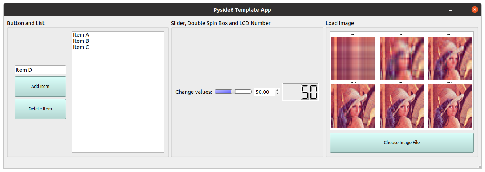
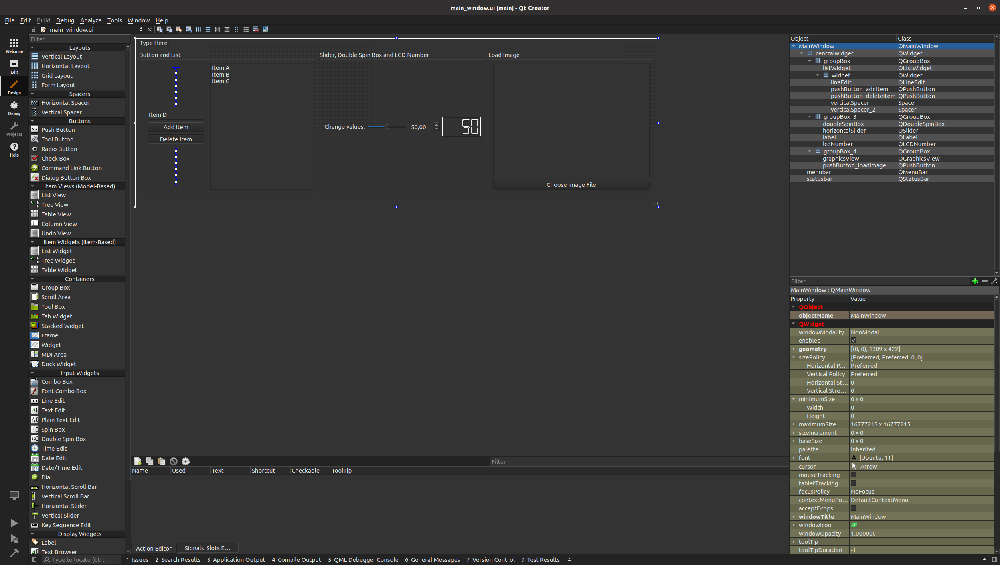

# pyside6_template

This repository can be a quick start or a reference for your PySide6 project.

- Example app while running:



- Designing with Qt Creator:



## Install Pyside6 & Run App

```bash
$ pip3 install pyside6
$ python3 my_app.py
```

## Useful Resources

- Download Qt Creator: https://www.qt.io/download
- PySide6 Documentation: https://doc.qt.io/qtforpython/quickstart.html

- Qt 6 Stylesheet Reference: https://doc.qt.io/qt-6/stylesheet-reference.html

